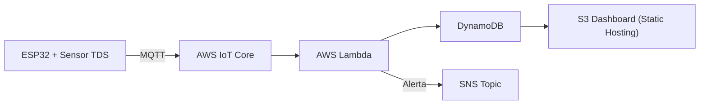

# Monitoramento de Qualidade da Água com Sensor TDS e ESP32

[](#)

## Sumário

* [Visão Geral](#visão-geral)
* [Arquitetura e Fluxo de Dados](#arquitetura-e-fluxo-de-dados)
* [Tecnologias Utilizadas](#tecnologias-utilizadas)
* [Estrutura do Projeto](#estrutura-do-projeto)
* [Pré‑requisitos](#pré‑requisitos)
* [Instalação](#instalação)
* [Configuração](#configuração)
* [Desenvolvimento](#desenvolvimento)
* [Testes Unitários](#testes-unitários)
* [Execução Local do Handler](#execução-local-do-handler)
* [Deploy (Opcional)](#deploy-opcional)
* [Infraestrutura AWS (Opcional)](#infraestrutura-aws-opcional)
* [Frontend](#frontend-web-dashboard)
* [Contribuição](#contribuição)
* [Licença](#licença)

---

## Visão Geral

Este projeto implementa um sistema completo de monitoramento de qualidade da água:

1. **Leitura de sensor**: um ESP32 (ou placa compatível) com sensor TDS faz medições periódicas.
2. **Transmissão MQTT**: os valores de TDS são enviados para o AWS IoT Core.
3. **Processamento serverless**: uma AWS Lambda (Python) consome mensagens, armazena em DynamoDB e dispara alertas SNS quando necessário.
4. **Dashboard estático**: visualização dos dados históricos hospedada no Amazon S3.

---

## Arquitetura e Fluxo de Dados



1. O dispositivo publica no tópico `esp32/tds` via MQTT.
2. IoT Core repassa para a Lambda de ingestão.
3. A Lambda grava no DynamoDB e, se o valor for crítico, publica no SNS.
4. Um dashboard estático lê do DynamoDB via API ou exportação e exibe gráficos.

---


## Tecnologias Utilizadas

* **Hardware**: ESP32, Sensor TDS V1.0
* **Protocolos**: MQTT para comunicação embarcada
* **AWS IoT Core**: broker MQTT gerenciado
* **AWS Lambda (Python 3.11)**: função de ingestão e alerta
* **AWS DynamoDB**: banco de dados NoSQL para séries temporais
* **AWS SNS**: notificação de alertas críticos
* **Amazon S3**: hospedagem de front-end estático
* **Terraform**: IaC para criar recursos AWS
* **Poetry**: gerenciamento de dependências e ambiente Python
* **Pytest & pytest-mock**: testes unitários com mocks

---

## Estrutura do Projeto

```
prat-mack-project/
├── arduino/src                  # Firmware Arduino com sensor TDS
│   └── main.ino
├── frontend/                 # Dashboard estático para S3
│   └── (html, js, css...)
├── lambda/                   # Backend de ingestão serverless
│   ├── app/
│   │   ├── __init__.py
│   │   └── handler.py        # Entry point da Lambda
│   ├── tests/
│   │   ├── __init__.py
│   │   └── test_handler.py   # Testes unitários com pytest e boto3 mocks
│   ├── pyproject.toml        # Configuração do Poetry
├── terraform/ # Arquivos do terraform
└── README.md                 # Documentação (você está aqui)
```

---

## Pré‑requisitos

* **Git**: para versionamento e clonagem
* **Python 3.11+**: ambiente de execução da Lambda
* **Poetry**: gerenciador de dependências e ambiente virtual
* **AWS CLI**: para configuração de credenciais e deploy manual
* **Terraform CLI** (opcional): provisionamento da infraestrutura AWS

**Recomendação**: use o Poetry in-project (`.venv/` em `lambda/`) para isolamento completo.

---

## Instalação

No diretório raiz do projeto:

```bash
# Clone e entre na pasta Lambda
git clone https://github.com/Herickwill/prat-mack-project
cd prat-mack-project/lambda

# Configure Poetry para criar venv no projeto (uma única vez)
poetry config virtualenvs.in-project true

# Instale dependências e crie .venv/
poetry install
```

Após isso, o ambiente virtual estará disponível em `lambda/.venv/`.

---

## Configuração

1. **Variáveis de ambiente**: crie `.env` em `lambda/` com:

   ```ini
   AWS_REGION=sa-east-1
   DYNAMODB_TABLE=WaterQualityTable
   MQTT_TOPIC=water/quality
   SNS_TOPIC_ARN=arn:aws:sns:sa-east-1:123456789012:agua-alertas
   ```
2. **AWS CLI**: configure credenciais se for usar infra ou deploy:

   ```bash
   aws configure
   ```
3. **Substitua** nomes de tabela e ARN conforme seu ambiente Terraform ou manual.

---

## Desenvolvimento

### Firmware Arduino

Siga estes passos para compilar e carregar o firmware no seu ESP32:

1. **Abra o projeto**

   * Na Arduino IDE, vá em **Arquivo > Abrir** e selecione `arduino/src/main.ino`.
2. **Selecione a placa**

   * Em **Ferramentas > Placa**, escolha **ESP32 Dev Module** (ou o modelo correspondente).
3. **Configure as bibliotecas**

   * Em **Sketch > Incluir Biblioteca > Gerenciar Bibliotecas**, instale:

     * `PubSubClient` (para MQTT)
     * `ArduinoJson` (para parsing, se usado)
4. **Atualize credenciais e endpoint**

   * No início do arquivo `main.ino`, defina:

     ```cpp
     const char* ssid     = "NOME DO SEU WIFI";
     const char* password = "SUA_SENHA";
     ```
5. **Conecte o ESP32**

   * Use um cabo USB para ligar o módulo ao computador.
6. **Compile e envie**

   * Clique no botão **Verificar** (check) para compilar.
   * Depois, clique em **Carregar** (Upload) para enviar ao ESP32.
7. **Monitor Serial**

   * Abra **Ferramentas > Monitor Serial**.
   * Ajuste a taxa para **115200 baud** e acompanhe as mensagens de conexão e leitura do sensor.

### Backend Python

Para desenvolver e depurar o lado servidor:

```bash
cd prat-mack-project/lambda
poetry shell
```

* Edite `app/handler.py` e outros módulos dentro de `lambda/app/`.
* Use linters opcionais:

  ```bash
  flake8 app/
  pylint app/handler.py
  ```

## Testes Unitários

Os testes usam `pytest`, `pytest-mock` e mockam `boto3.client`:

```bash
cd prat-mack-project/lambda
poetry run pytest --cov=app tests
```

* `--cov=app` gera cobertura de testes.
* Verifique relatório em `htmlcov/index.html`.

Exemplo de testes em `lambda/tests/test_handler.py` simula DynamoDB e SNS:

```python
# veja o exemplo fornecido no diretório tests
```

---

## Execução Local do Handler

**Aviso**: sem recursos AWS criados **não** será possível executar a função contra a AWS.

Você pode chamar a função localmente, mas **apenas** para depuração de código:

```bash
poetry shell
python - << 'EOF'
from app.handler import lambda_handler
print(lambda_handler({'caixa_id':'cx1','valor_sensor':42,'timestamp':0}, None))
EOF
```

Esse comando pode gerar erros de credenciais se `boto3.client` não encontrar AWS válidas. Prefira usar os testes unitários.

---

## Deploy (Opcional)

Para deploy manual da Lambda, crie um ZIP contendo apenas `app/`:

```bash
cd lambda/app
zip -r ../lambda-deploy.zip .
```

Depois, use AWS CLI:

```bash
aws lambda update-function-code \  
  --function-name SeuLambdaName \  
  --zip-file fileb://lambda-deploy.zip
```

---

## Infraestrutura AWS (Opcional)

Se desejar provisionar TODOS os recursos via Terraform:

```bash
cd lambda/terraform
terraform init
terraform apply
```

Após o deploy, atualize seu `.env` com o nome da tabela e ARN do SNS retornados.

---

## Frontend Web Dashboard

O dashboard estático é hospedado no S3 e consome dados via API/DynamoDB. **Não é possível** executá-lo localmente devido a restrições de CORS nos navegadores. Se você realmente quiser testar offline, seria necessário **desabilitar as políticas de CORS** no browser ou usar extensões específicas, o que **é perigoso** e **não recomendado**.

**Acesso recomendado:**
[https://frontend-bucket-mackenzie-prat-prof.s3.sa-east-1.amazonaws.com/index.html](https://frontend-bucket-mackenzie-prat-prof.s3.sa-east-1.amazonaws.com/index.html)


## Contribuição

1. Fork o repositório.
2. Crie uma branch de feature (`git checkout -b feature/XYZ`).
3. Faça commits atômicos e com mensagens claras.
4. Rode `poetry run pytest` e garanta cobertura.
5. Abra Pull Request e descreva mudanças.
6. Aguarde aprovação do PR pelo Herickwill.

---

## Licença

Este projeto não está licenciado. Para mais detalhes, contatar os mantenedores do projeto.
